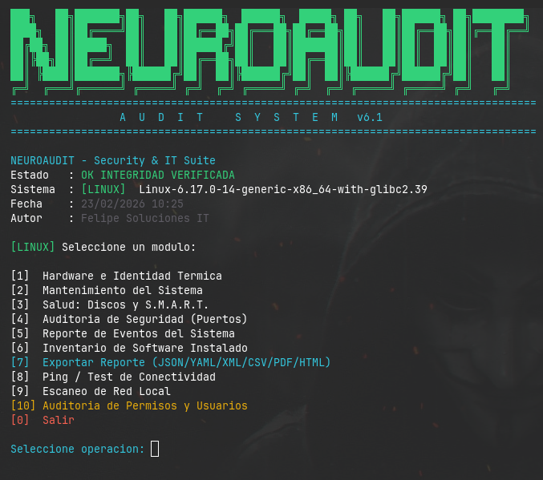

<p align="center">
  
</p>

# 🛡️ NEUROAUDIT - Security & IT Suite
**Desarrollado por: Felipe Soluciones IT** 
**Versión:** 4.6 Tech Edition  
**Estado de Integridad:** ✅ Dinámicamente Verificado

---

## 🚀 Descripción
**NeuroAudit** es una suite integral de auditoría y mantenimiento para sistemas basados en Linux (especialmente optimizada para **Zorin OS, Ubuntu y Debian**). Esta herramienta nace de la necesidad de centralizar diagnósticos de hardware, seguridad de red y optimización del sistema en una sola interfaz ágil y profesional.

Ideal para técnicos de soporte, administradores de sistemas y entusiastas del *Self-Hosting / Homelab*.


---

## ✨ Características Principales
* **🔍 Auditoría de Hardware:** Reporte detallado de CPU (con temperatura en tiempo real), memoria RAM, Kernel y número de serie del equipo.
* **🔋 Diagnóstico de Salud (PRO):** Monitoreo de ciclos de batería y estado **S.M.A.R.T.** de unidades de almacenamiento para prevenir fallos de hardware.
* **🛡️ Auditoría de Seguridad:** Escaneo rápido de puertos en estado *LISTEN* para detectar posibles brechas o servicios expuestos.
* **⚙️ Mantenimiento Automatizado:** Limpieza profunda de residuos, purga de paquetes innecesarios y actualización inteligente del sistema según el gestor (APT/DNF/PACMAN).
* **✅ Integridad Dinámica:** Sistema de validación interna que asegura que el script no ha sido modificado o dañado.

---

## 🛠️ Instalación Rápida (One-Liner)

Para instalar NeuroAudit de manera global en tu sistema, ejecutá el siguiente comando en tu terminal:

```bash
curl -L -O "[https://raw.githubusercontent.com/N1x-afl/neuroaudit/main/neuroaudit.py](https://raw.githubusercontent.com/N1x-afl/neuroaudit/main/neuroaudit.py)" && chmod +x neuroaudit.py && sudo mv neuroaudit.py /usr/local/bin/neuroaudit

